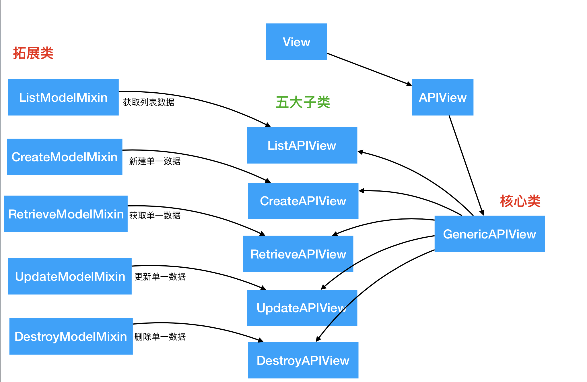
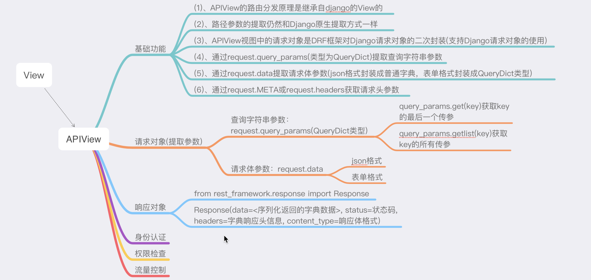
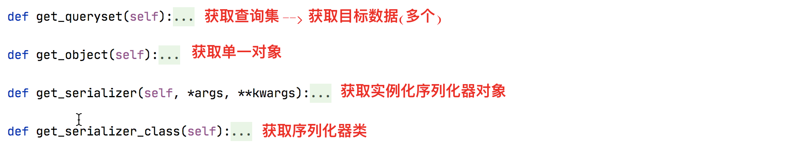
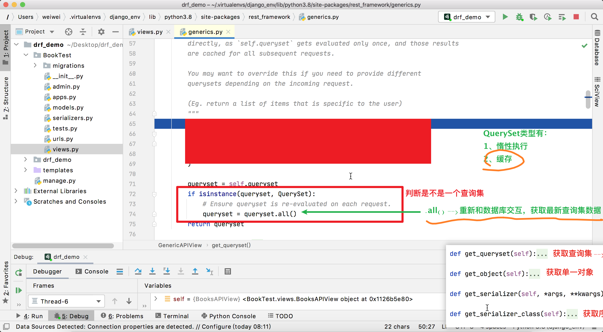
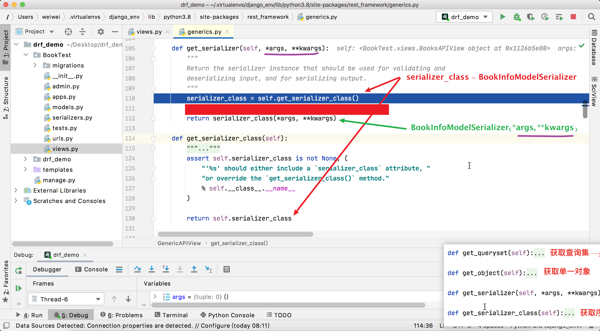
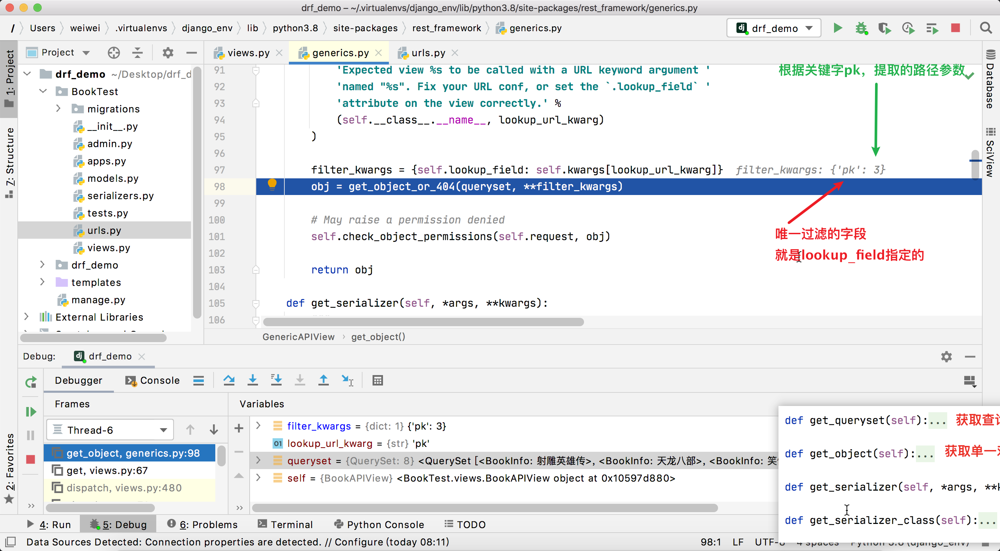

### 一、基本视图继承简图

### 二、`APIView`视图功能

`APIView`是DRF框架中的最基础视图，继承自Django的`View`。

### 三、`GenericAPIView`通用视图功能

`GenericAPIView`通用视图，封装了一套使用序列化器进行序列化和反序列化操作的抽象通用方法，来完成对模型类增删改查。我们需要掌握这些抽象的方法的功能，因为后续业务开发的时候可能需要我们去重写这些方法。

#### 1、获取默认查询集

`self.get_queryset()`返回默认查询集，默认返回类属性`queryset`指定默认查询集。

通过源码可以观察出，该函数会调用`QuerySet`的`all()`方法保证每一次请求都获取最新的查询集数据，避免`QuerySet`缓存带来的数据不同步的问题。

#### 2、获取序列化器对象

`self.get_serializer()`函数返回一个序列化器对象，默认返回的是类属性`serializer_class`指明的序列化器类对象。

`self.get_serializer()`函数内部间接调用`self.get_serializer_class()`来获取指定的序列化器类，而`self.get_serializer_class()`函数默认返回的就是类属性`serializer_class`指定的序列化器类。

#### 3、获取单一对象

`self.get_object()`函数返回过滤出来的单一模型类对象。

该函数依赖类属性：

- (1)、`queryset`: 指定过滤查询集

- (2)、`lookup_field`: 指定过滤的依据字段，默认值就是pk
- (3)、`lookup_url_kwarg`: 路由提取的前端传值主键值使用的关键字, 默认值等于`lookup_field`

### 四、拓展类视图

#### 1、`ListModelMixin`

列表视图扩展类，提供`list(request, *args, **kwargs)`方法快速实现列表视图，返回200状态码。

该Mixin的list方法会对数据进行过滤和分页。

#### 2、`CreateModelMixin`

创建视图扩展类，提供`create(request, *args, **kwargs)`方法快速实现创建资源的视图，成功返回201状态码。

如果序列化器对前端发送的数据验证失败，返回400错误。

#### 3、`RetrieveModelMixin`

详情视图扩展类，提供`retrieve(request, *args, **kwargs)`方法，可以快速实现返回一个存在的数据对象。

如果存在，返回200， 否则返回404。

#### 4、`UpdateModelMixin`

更新视图扩展类，提供`update(request, *args, **kwargs)`方法，可以快速实现更新一个存在的数据对象。

同时也提供`partial_update(request, *args, **kwargs)`方法，可以实现局部更新。

成功返回200，序列化器校验数据失败时，返回400错误。

#### 5、`DestroyModelMixin`

删除视图扩展类，提供`destroy(request, *args, **kwargs)`方法，可以快速实现删除一个存在的数据对象。

成功返回204，不存在返回404。

### 五、子类视图

#### 1、`CreateAPIView`

提供 post 方法

继承自： GenericAPIView、CreateModelMixin

#### 2、`ListAPIView`

提供 get 方法

继承自：GenericAPIView、ListModelMixin

#### 3、`RetireveAPIView`

提供 get 方法

继承自: GenericAPIView、RetrieveModelMixin

#### 4、`DestoryAPIView`

提供 delete 方法

继承自：GenericAPIView、DestoryModelMixin

#### 5、`UpdateAPIView`

提供 put 和 patch 方法

继承自：GenericAPIView、UpdateModelMixin

#### 6、`RetrieveUpdateAPIView`

提供 get、put、patch方法

继承自： GenericAPIView、RetrieveModelMixin、UpdateModelMixin

#### 7、`RetrieveUpdateDestoryAPIView`

提供 get、put、patch、delete方法

继承自：GenericAPIView、RetrieveModelMixin、UpdateModelMixin、DestoryModelMixin

